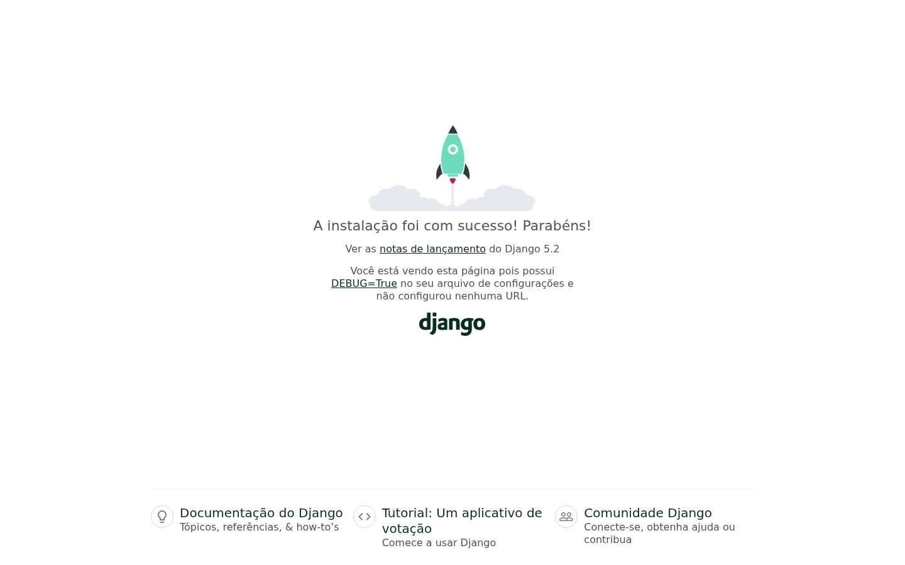

# Portfólio Django — EBAC

Projeto criado para iniciar a construção de um portfólio com Django durante o curso Full Stack Python da EBAC.

## Tecnologias

- Python 3.12
- Django 5.2 LTS
- SQLite

## Estrutura

- `portfolio/`: configurações principais do projeto Django;
- `blog/`: aplicativo inicial do portfólio;
- `docs/`: evidência visual do projeto em execução.

## Como executar

```bash
python -m venv .venv

# Linux/macOS
source .venv/bin/activate

# Windows PowerShell
.venv\Scripts\Activate.ps1

pip install -r requirements.txt
python manage.py migrate
python manage.py runserver
```

Acesse `http://127.0.0.1:8000/` no navegador.

## Evidência de funcionamento


